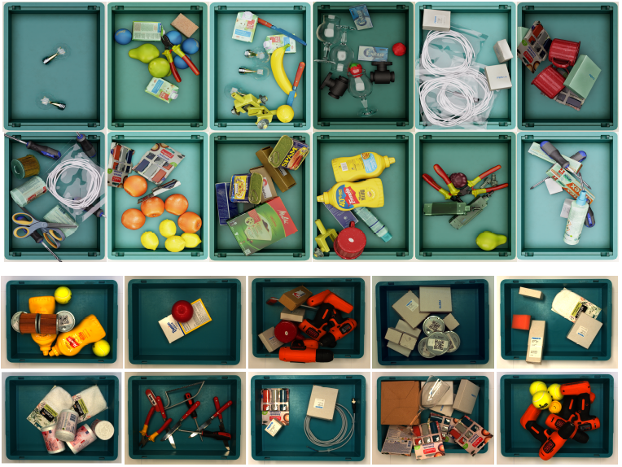
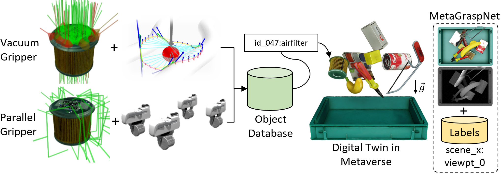
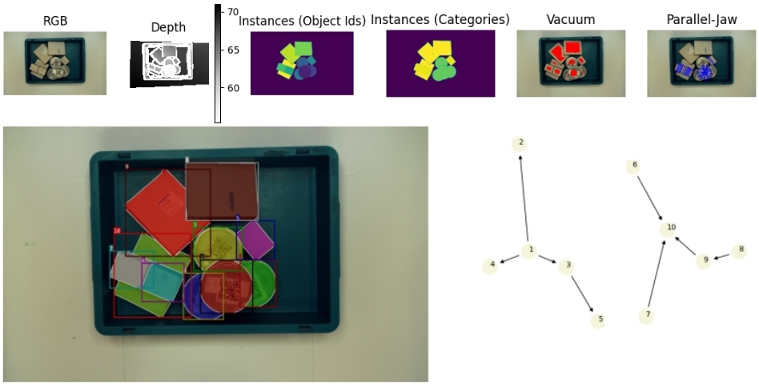
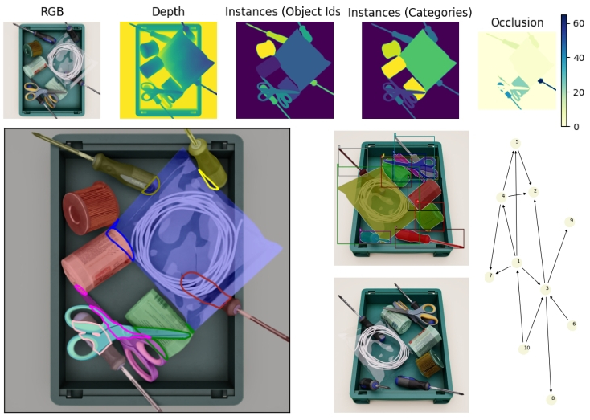
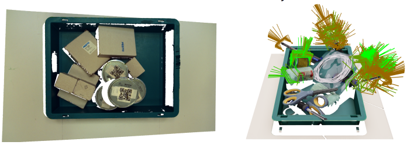

# MetaGraspNet
<p align="center">

</p>

# News [dd/mm/yyyy]
- [04/11/2022] **Physics Simulation Online:** Example code for simulating paralleljaw grasps in Isaac Gym available.
- [27/10/2022] **Grasp Sampling Online:** Example code for sampling of paralleljaw and vacuum grasp labels available.
- [26/07/2022] **Additional Synthetic Data:** Additional training data available.

# Installation
Create custom conda environment and activate it.
```
conda env create -f environment.yml
conda activate metagraspnet_env
```
Prerequisites : Miniconda3, Ubuntu 20.04, Python 3.8. **GPU not needed** for working with dataset!

# Downloads
You can download the **synthetic dataset** from [Link](https://nx25922.your-storageshare.de/s/t27q8mmbDe4WpNG). Unzip and save in `./dataset_sim`.

You can download the **real world dataset** set from [Link](https://nx25922.your-storageshare.de/s/nCqtsgAZWtP3fCz). Unzip and save in `./dataset_real`.

# License
The codebase and dataset are under **CC BY-NC-SA 3.0 license**. You may only use the database for academic purposes. Any kind of commercial or military usage forbidden. For more details [see](https://creativecommons.org/licenses/by-nc-sa/3.0/).


# Citation
If you find our work useful, please consider citing.
```
@inproceedings{metagraspnet2022,
    title     = {{MetaGraspNet}: A Large-Scale Benchmark Dataset for Scene-Aware
Ambidextrous Bin Picking via Physics-based Metaverse Synthesis},
    author    = {Maximilian, Gilles and Chen, Yuhao and Winter, Tim Robin and Zeng, E. Zhixuan and Wong, Alexander},
    year      = {2022},
    booktitle = {IEEE International Conference on Automation Science and Engineering (CASE) [in press]}
}
```

# Dataset
<p align="center">

</p>


## Visualizing Synthetic And Real World Scenes and Exploring the Labels 
You can visualize scenes in 2D and 3D. For visualizing the **real world data**, add `--real_data` and `--real_data_grasps` argument in 2D.
### Real 2D
```
python Scripts/visualize_2d.py --data_root ./dataset_real --viewpt 3 --scene 418 --real_data --real_data_grasps --visualize_layout
```
<p align="center">

</p>


### Synthetic 2D
```
python Scripts/visualize_2d.py --data_root ./dataset_sim --scene 1557 --viewpt 0 --visualize_layout
```

<p align="center">

</p>

### Real/ Synthetic 3D

```
python ./Scripts/colored_pcl.py --data_root ./dataset_real --scene 418 --viewpt 3

python ./Scripts/colored_pcl.py --data_root ./dataset_sim --scene 1557 --visualize_parallel_gripper --colorize_per_score analytical --viewpt 0
```
<p align="center">

</p>


# Models
You can download the models from [Link](https://nx25922.your-storageshare.de/s/9KrFffzwoTmtapR). A config file of the labels is [here](./models/ifl_labels.py).

We advise to use [meshlab](https://www.meshlab.net/#download) for viewing the .obj meshes. 


# Structure
## Scene Structure
The groundtruth for each viewpoint is contained in `.../scene*/*_scene.hdf5` file. You can read it with [h5ls](https://www.rdocumentation.org/packages/rhdf5/versions/2.16.0/topics/h5ls).

```
h5ls ./dataset_sim/scene0/0_scene.hdf5
```
The file is structured as follows
<font size="1"> 
```
    |>camera
       |>poses_relative_to_world
    |>keypts
      |>com
        |>keypts_relative_to_camera
        |>object_id
      |>byhand
        |>keypts_relative_to_camera
        |>object_id
        |>occluded_keypts_relative_to_camera
        |>occluded_object_id
    |>non_colliding_grasps
      |>paralleljaw
        |>contact_poses_relative_to_camera
        |>contact_width
        |>franka_poses_relative_to_camera
        |>object_id
        |>score_analytical
        |>score_simulation
        |>score_wrench
      |>suctioncup
        |>contact_poses_relative_to_camera
        |>object_id
        |>score_analytical
        |>score_simulation
        |>suction_poses_relative_to_camera
    |>objects
      |>bbox_loose
      |>categories
      |>poses_relative_to_camera
```
</font>

## Model Structure

```
h5ls ./models_ifl/064/textured.obj.h5ls
```
The file is structured as follows
<font size="1"> 
```
    |>grasps
      |>paralleljaw
        |>pregrasp_transform
        |>quality_score
        |>quality_score_simulation
      |>suctioncup
        |>pregrasp_transform
        |>quality_score
    |>keypts
      |>byhand
      |>com
```
</font>

# Visualize Object 
You can explore the individuals objects labels with:

**Parallel-Jaw Grasp Labels**
```
python ./Scripts/visualize_labels.py --root ./models --dataset_name models_ifl --object 064 --parallel_grasps --simulation --score_min 0.8 --max_grasps 100
```

**Vacuum Grasp Labels**
```
python ./Scripts/visualize_labels.py --root ./models --dataset_name models_ifl --object 064 --suction_grasps --analytical --max_grasps 500
```

**Keypoints**
```
python ./Scripts/visualize_labels.py --root ./models --dataset_name models_ifl --object 008 --keypts_byhand
```
**Center of Mass**
```
python ./Scripts/visualize_labels.py --root ./models --dataset_name models_ifl --object 008 --keypts_com
```


# Customizing MetaGraspNet
Our proposed dataset is already very comprehensive, however metaverses allow for customizing data generation. 
We provide scripts for that as well, you can find them below.


## Adding custom objects

You can add custom .obj meshes by following the provided file structure in ./models.

## Vacuum Grasps
We provide scripts to generate your own vacuum grasps based on our proposed cup model:
```
python ./grasps_sampling/scripts/sample_grasps.py --mesh_root ../models/models_ifl/ --suction --max_grasps 10
```
## Parallel-Jaw Grasps
You can sample antipodal grasps with:
```
python ./grasps_sampling/scripts/sample_grasps.py --mesh_root ../models/models_ifl/ --paralleljaw --max_grasps 10
```
## Parallel-Jaw Grasps in Isaac Gym
<p align="center">

</p>

For generating parallel grasps based on physics simulation, please fullfill installation process from [IsaacGym](https://developer.nvidia.com/isaac-gym). Scripts are tested for **isaac gym version 1.0.preview2**. After you have set up a working isaac gym environment, start simulating with: (existing simulation data will be overwritten!)
```
(rlgpu) python ./physics_simulation/paralleljaw_simulation.py --root ../models/models_ifl/ --visualize --num_envs 16 --categories 008
```
## Adding Custom Keypts to models

We provide GUI scripts to let you label your own keypts. You can start the label gui with:

```
python ./Scripts/pcl_label_gui.py --data_root ./models --dataset_name models_ifl --object_idx 064
```
A window should appear where you can start labeling. You can move around with **[left mouse]** click, move your mouse cursor to the desired point on the mesh and add a keypt with **[right mouse]** click. The keypoint should appear in the scene, in case you want to remove it you can go over the created keypoint and **[scroll wheel]** click. It should disappear again (please be aware: you can only remove the last keypoint). When you are done, press **[s]** to save it to file or close with **[q]**.

## Generating Custom Data (coming soon)

We provide scripts which enable you to create your own custom dataset. After successful installation of [Isaac Sim](https://developer.nvidia.com/isaac-sim) Python API, you can start creating custom data with
```
(isaac-sim) python ./scripts/dataset_physics.py --categories power_drill --root /home/XYZ/metagraspnet/models --dataset_name models_ifl [--randomize]
```

# Project History
**MetaGraspNet_v0:** A previous version of our MetaGraspNet project can be found [here](https://arxiv.org/abs/2112.14663).
